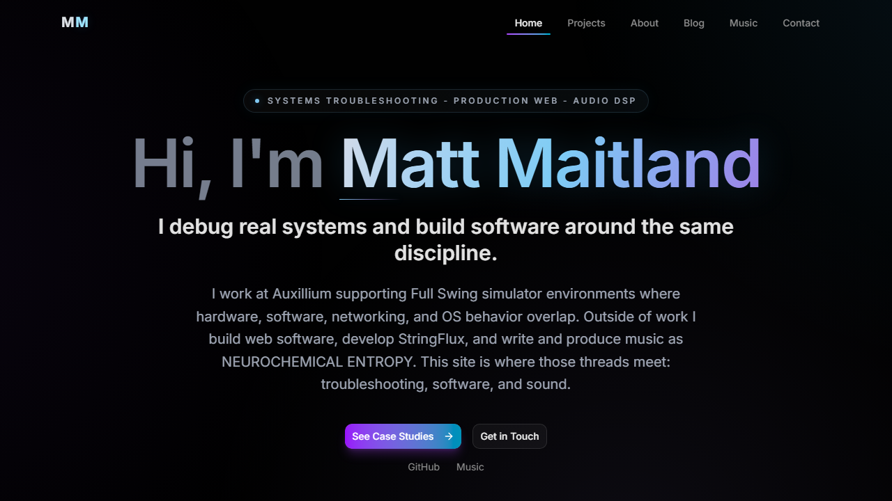
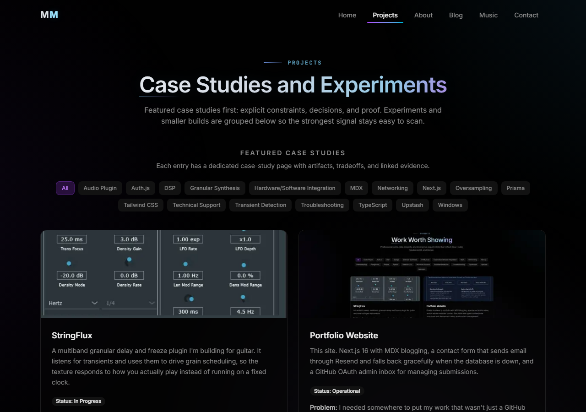

# Matt Maitland - Portfolio

**Live site:** [mmaitland.dev](https://mmaitland.dev)

Portfolio site and engineering case-study repo for mmaitland.dev. Built with Next.js, TypeScript, and Tailwind CSS, with MDX blogging, a rate-limited contact pipeline, and optional admin inbox/auth features behind explicit configuration.

## Goals and intent

This project is a **professional portfolio**, not a build diary. The intent is to show how work is reasoned about and verified:

- **Evidence over hype.** Public claims should point at something checkable: case studies, decision records, tests, CI, or other artifacts. When proof lags copy, **soften the claim** rather than inventing placeholder proof. Messaging changes that touch claims should align with [docs/proof-audit.md](docs/proof-audit.md).
- **One coherent story across domains.** Production troubleshooting (multi-layer systems), shipping web software (this site), and audio/DSP work are presented as one discipline: **diagnose constraints, then deliver** within them.
- **Featured work carries a higher bar.** Anything marked **featured** in `src/content/projects.ts` is expected to have a real case-study path: constraints, tradeoffs, status, known limits, and `proofLinks` where applicable. **Experiments** stay visible but separate so they do not dilute the main signal.
- **Production-shaped engineering.** Optional services (database, auth, email) are **gated by typed env** so the app runs and tests cleanly without them; contact and admin flows degrade predictably when configuration is partial.
- **CI as part of the story.** Lint, unit/data tests, production build, and Playwright smoke on `main` back the idea that the repo is maintained to the same standard the site describes.

## Maintenance

- **Weekly:** Ship one proof/content task and one polish/maintenance task. If homepage, featured-project, or resume-adjacent copy changed, skim [docs/proof-audit.md](docs/proof-audit.md) before merge and update any row whose public claim moved.
- **Weekly:** For messaging changes, answer this in the PR: **what proof got stronger, or what language got softer?**
- **Publishing cadence:** Aim for one short post per maintenance cycle (for example each four-week rotation) when possible, even if brief, as long as it has a clear job: decision, tradeoff, or incident pattern.
- **Monthly:** Do one resume parity check. After any user-visible `src/content/resume.ts` change, run `npm run resume:pdf` with the dev server running so `public/resume.pdf` does not drift.
- **Monthly:** Re-check canonical URL / metadata consistency, featured-project proof links, and dependency hygiene so the public story and shipped repo stay aligned.
- **Definition of done:** Run `npm run lint`, `npm test`, and `npm run build`. If nav, focus, or keyboard behavior changed, also run `npx playwright test`.

## Preview

Screenshots from the production deployment (1280px viewport).

| Homepage | Projects |
| --- | --- |
|  |  |

## What this repo demonstrates (technically)

These items support the goals above:

- Structured content for projects (with status, limits, and proof links), resume data, and MDX posts
- Typed environment and optional-feature gating (`src/lib/env.ts`)
- Operational safeguards: validation, rate limiting, and graceful behavior when optional services are missing
- CI-backed quality: lint, tests, production build, and route smoke coverage on `main`

## Tech Stack

- **Next.js 16** (App Router, Server Components, Server Actions)
- **TypeScript**
- **Tailwind CSS v4** + **shadcn/ui**
- **Framer Motion** for animations
- **MDX** via `next-mdx-remote` for blog posts
- **Prisma** + PostgreSQL (Neon) for persistence
- **Auth.js v5** (next-auth) with GitHub OAuth
- **Resend** for contact form emails
- **Upstash Redis** for server-side rate limiting

**Auth.js (next-auth):** The app uses **Auth.js v5** via the `next-auth` package, which is still published as a **5.x beta** while the stable v5 line and docs fully settle. This repo **pins a specific beta** and only enables admin GitHub OAuth when the required env vars are present, so production behavior is gated and testable. Staying on beta is a deliberate tradeoff for **App Router + Auth.js v5 integration**; plan to **revisit the pin** when an appropriate stable release is available and migration cost is low.

**Branching and releases:** Work merges into **`main`** through **pull requests**; CI on `main` runs **lint**, **unit/data tests**, **production build**, and **Playwright smoke tests**. Treat **green `main`** as the release line for deployment (for example Vercel production from `main`).

## Getting Started

Clone using the repository name (matches `package.json` `name`: `mmaitland-portfolio`).

**PowerShell (Windows):**

```powershell
git clone https://github.com/mmaitland300/mmaitland-portfolio.git
cd mmaitland-portfolio
Copy-Item .env.example .env   # then fill in values (see below)
npm install            # also runs prisma generate via postinstall
npm run dev
```

**Unix / macOS (bash):**

```bash
git clone https://github.com/mmaitland300/mmaitland-portfolio.git
cd mmaitland-portfolio
cp .env.example .env   # then fill in values (see below)
npm install            # also runs prisma generate via postinstall
npm run dev
```

Open [http://localhost:3000](http://localhost:3000).

`next-env.d.ts` is generated by Next.js and gitignored; it is referenced from `tsconfig.json`. If your editor reports a missing file before the first run, execute `npm run dev` or `npm run build` once to create it.

## Environment Variables

Copy `.env.example` to `.env` and fill in the values. **Required = No** applies only to the rows marked **No** in the table below: those gate **admin GitHub OAuth**, **database-backed** inbox features, and the optional **resume PDF link** override. Omitting them turns off those paths; the app still runs and the default test/build story stays predictable.

**Required = Yes** means you need those entries for a typical local or production setup (public site URL, contact email via Resend, Upstash Redis for rate limiting, and Prisma placeholder URLs for `npm install` / `prisma generate` / `npm run build`). GitHub **CI** only sets stub `DATABASE_URL`, `DIRECT_URL`, and `NEXT_PUBLIC_SITE_URL` for install, lint, test, and build; it does not inject Resend or Redis secrets, which matches how a production build compiles without those values in the environment.

| Variable | Required | Purpose |
|---|---|---|
| `NEXT_PUBLIC_SITE_URL` | Yes | Base URL for metadata, sitemap, OG images |
| `RESEND_API_KEY` | Yes | Resend API key for contact form delivery |
| `CONTACT_FROM_EMAIL` | Yes | Sender address for contact emails |
| `CONTACT_TO_EMAIL` | Yes | Recipient address for contact emails |
| `UPSTASH_REDIS_REST_URL` | Yes | Upstash Redis URL for rate limiting |
| `UPSTASH_REDIS_REST_TOKEN` | Yes | Upstash Redis token |
| `DATABASE_URL` | Yes[1] | Placeholder or Neon pooled URL. Required for `prisma generate` (see note below). Runtime DB features need a real Neon URL. |
| `DIRECT_URL` | Yes[1] | Placeholder or Neon direct URL for Prisma CLI migrations. Same note as `DATABASE_URL`. |
| `AUTH_SECRET` | No | Auth.js secret (`npx auth secret` to generate). Required for admin auth. |
| `AUTH_GITHUB_ID` | No | GitHub OAuth app client ID. Required for admin auth. |
| `AUTH_GITHUB_SECRET` | No | GitHub OAuth app client secret. Required for admin auth. |
| `ADMIN_GITHUB_IDS` | No | Comma-separated GitHub numeric user IDs for admin access |
| `NEXT_PUBLIC_RESUME_PDF_LINK_BASE` | No | Override base URL for absolute links on `/resume/print` (defaults: `www.mmaitland.dev` for this domain and for localhost; otherwise `NEXT_PUBLIC_SITE_URL`). Hostnames without a scheme get `https://` like `NEXT_PUBLIC_SITE_URL`. |

[1] **Prisma tooling:** `prisma.config.ts` reads `DATABASE_URL` and `DIRECT_URL` via `env()`, so they must exist in `.env` for `npm install` (postinstall `prisma generate`) and `npm run build`. Copy the syntactically valid placeholders from `.env.example` until you point them at Neon; no Postgres process is required on your machine for generation or production build.

## Database Setup (Optional)

The site works without a database. To enable the admin inbox and contact persistence:

1. Create a [Neon](https://neon.tech) PostgreSQL database.
2. Replace the Prisma placeholders in `.env` with your Neon pooled (`DATABASE_URL`) and direct (`DIRECT_URL`) URLs.
3. Apply the schema: `npx prisma migrate deploy` (uses `prisma/migrations`). For a throwaway local database you can use `npx prisma db push` instead.

For hosted environments that use migration history, apply pending migrations during deploy or release with `npm run db:migrate:deploy` against your real database (not part of `npm run build`).

Note: the contact flow guarantees email delivery first. Database persistence for the admin inbox runs after a successful email send and is best-effort.

## Auth Setup (Optional)

To enable the admin dashboard at `/admin`:

1. Create a [GitHub OAuth App](https://github.com/settings/developers) (callback URL: `http://localhost:3000/api/auth/callback/github`).
2. Set `AUTH_SECRET`, `AUTH_GITHUB_ID`, and `AUTH_GITHUB_SECRET` in `.env`.
3. Set `ADMIN_GITHUB_IDS` to your GitHub numeric user ID (find it at `https://api.github.com/users/YOUR_USERNAME`).

## Project Structure

```
src/
  app/            # Next.js App Router ((site) = nav chrome; `resume/layout` skips chrome for /resume/print)
  actions/        # Server Actions (contact form, inbox mutations)
  components/     # UI and section components
  content/        # Blog posts (MDX) and project/resume data
  lib/            # Utilities (MDX, Prisma, auth, admin helpers)
  generated/      # Prisma client (auto-generated, gitignored)
prisma/           # Prisma schema
public/           # Static assets, game embeds, resume PDF
```

## Content Management

**Blog posts** live in `src/content/blog/` as `.mdx` files with YAML frontmatter:

```yaml
---
title: "Post Title"
description: "Short description"
date: "2026-03-18"
tags: ["Next.js", "TypeScript"]
published: true
---
```

Set `published: false` to keep a post as a draft (hidden from listings and direct URL access).

**Projects** are defined in `src/content/projects.ts`. Each entry has a `category` of `"featured"` or `"experiment"`.

**Resume data** is centralized in `src/content/resume.ts` and consumed by both the `/about` and `/resume` pages.

**Resume PDF (`public/resume.pdf`):** The file served at `/resume.pdf` may lag `resume.ts`. Treat **`src/content/resume.ts` as source of truth** for resume copy; regenerate the PDF in a dedicated change when you want the download to match.

**Regenerate the PDF (automated):** With the site running locally (for example `npm run dev` on port 3000), run `npm run resume:pdf`. That uses Playwright to print the **print-first** route **`/resume/print`** (no site nav/footer; light layout) to `public/resume.pdf`. Override the origin with `RESUME_PDF_ORIGIN` if you use another host or port (for example `RESUME_PDF_ORIGIN=http://127.0.0.1:3001 npm run resume:pdf`).

**Links inside the print resume:** Relative highlight `href` values (for example `/projects/...`) are expanded to absolute URLs for the print layout using **`getResumePdfLinkBase()`** (`src/lib/site-url.ts`): `mmaitland.dev` and local dev both map to **`https://www.mmaitland.dev`** so PDFs stay usable standalone. Forks can set **`NEXT_PUBLIC_RESUME_PDF_LINK_BASE`** (optional env) to override.

## Scripts

| Command | Description |
|---|---|
| `npm run dev` | Start development server |
| `npm run build` | Generate Prisma client and build for production (no DB connection) |
| `npm run db:migrate:deploy` | Apply Prisma migrations to the target database (run at deploy/release) |
| `npm start` | Start production server |
| `npm run lint` | Run ESLint |
| `npm test` | Run unit and data-integrity tests (Vitest) |
| `npm run resume:pdf` | Print `/resume/print` to `public/resume.pdf` (needs local server; see Content Management) |

## License

This project is licensed under the [MIT License](LICENSE).

## Contributing

For merge policy, author identity checks, and copy/encoding guardrails, see [CONTRIBUTING.md](CONTRIBUTING.md).

Use clear, imperative commit subjects (for example: `Fix contact rate limit when Redis is unavailable`). Avoid redeploy-only checkpoints and trailing vendor or tool-generated footer lines unless a policy explicitly requires them.

Optional: from the repo root, run `git config commit.template .gitmessage` to use the shared [commit template](.gitmessage). The first line of the message must not start with `#` (Git strips comment lines). That template is a local reminder only - Git does not enforce commit message style.

## Git history

Rewriting `main` with `git rebase`, `git filter-repo`, or similar and force-pushing has collaboration and fork tradeoffs - plan with anyone who depends on the repo.

- **Commit message noise only** (WIP, checkpoints, vendor footers): clearer messages going forward are enough for many projects; rewriting history is optional polish if old noise still bothers you.
- **Secrets that ever reached Git history**: treat that as a **security incident**, not cosmetics. **Rotate and revoke** exposed credentials first, run a dedicated secret scan on full history, and **rewrite history** (or archive this repo and publish a clean replacement) so the secrets are not recoverable from any branch. Optional rewrite is the wrong framing here.

## GitHub repository metadata

Set the repository **About** description (mirrors `package.json` / this README):

> Evidence-forward portfolio and case studies for mmaitland.dev - Next.js, MDX, Prisma, optional admin and auth.

**Suggested topics** (improve discoverability): `nextjs`, `typescript`, `tailwindcss`, `mdx`, `prisma`, `postgresql`, `portfolio`, `next-auth`, `server-actions`, `framer-motion`, `vitest`
